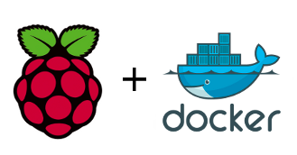

# JAVA Oracle no Raspberry Pi


# JAVA




Este container Docker implementa Java Oracle no Raspberry pi.

 * Balenalib base image: [balenalib/rpi-raspbian](https://hub.docker.com/r/balenalib/rpi-raspbian)
 * Java

Para operar as funcionalidades você precisará usar a ferramenta Makefile.

* Definição:

	 * Um arquivo `Makefile` é um arquivo contendo um conjunto de diretivas usadas pela ferramenta de automação de compilação make para gerar um alvo/meta. Sua função é direcionar o make sobre como compilar e vincular um programa.

### Installation from [Docker registry hub](https://registry.hub.docker.com/u/paperinik/rpi-java/).

# Premissas

1) Conhecimento em docker (versão do Docker > 1.12.3)

## Referências:
1)  * [RaspberryPi Wiki](https://pt.wikipedia.org/wiki/Raspberry_Pi)
2) Para quem quiser aprender docker:
    * [Docker](https://www.garagemdigital.io/docker-o-que-e/)
    * [LearnDocker Workshop](https://events.docker.com/learndocker-workshop/)
3) Makefile
	* [Makefile Wikipedia](https://pt.wikipedia.org/wiki/Makefile)
	* [Makefile com Docker](https://medium.com/tech-grupozap/makefile-docker-93a28cd2aa92)
    * Instalação: `sudo apt install build-essential`

- Processos automatizados com make:

* `help`: descreve as tarefas
* `clean`: remove a pasta node_modules
* `repo-login`: faz login no dockerhub
* `build`: crio container
* `build-nc`: crio container sem cache
* `remove`: remove imagem
* `rebuild`: chama as tarefas de `remove` e `build`
* `save`: salva imagem em arquivo
* `load`: carrega imagem previamente salva
* `push`: publica o container no repositório de artefatos
* `pull`: faz o download do container no repositório de artefatos
* `run`: inicializa o container
* `up`: roda as tarefas: build e run
* `dev`: roda as tarefas: build-nc e run
* `stop`: para o container e remove a execução
* `dangling`: remove todas as imagens do tipo dangling (temporárias)
* `publish-latest`: publica a imagem criada como última no ecr (repositório de artefatos)
* `publish-version`: publica a imagem com a versão corrente no ecr (repositório de artefatos)
* `publish`: roda as tarefas: repo-login, publish-latest e publish-version
* `tag-version`: nomeia a imagem com a versão corrente
* `tag-latest`: nomeia a imagem criada como última
* `tag`: roda as tarefas: tag-latest e tag-version
* `removecontainers`: para todos os containers em execução e remove
* `sonar`: roda o sonar-scanner para fazer a análise pelo sonar

# Como funciona: 

```sh
make run
```
* Para enviar suas próprias imagens para o seu repositório:
- `make publish`

* Para extrair imagens do seu repositório:
- `make pull`

